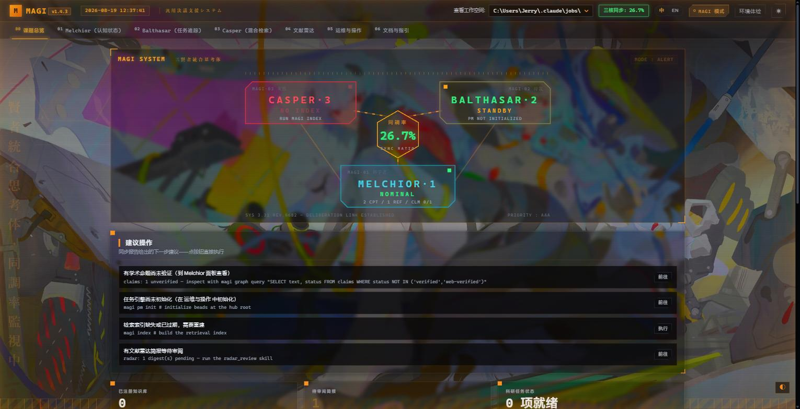
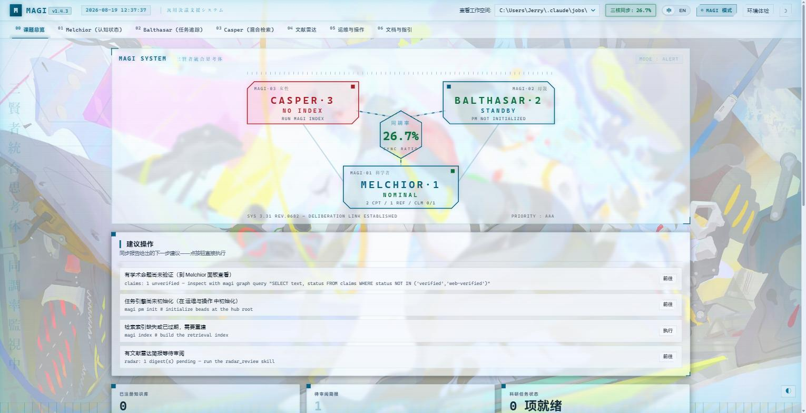
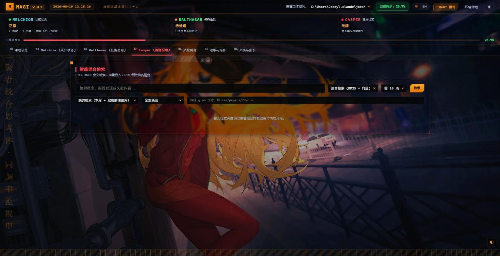
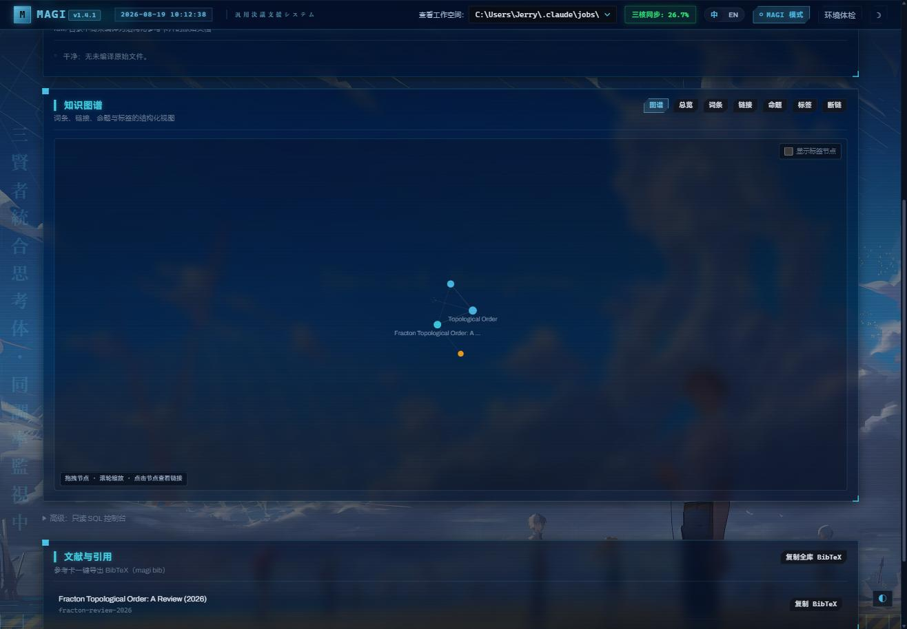

# MAGI

*[中文](README.md) | [English](README_en.md)*

**MAGI** 是一个 agent-native 的科研工作环境：人是驾驶员，LLM agent 是机体，确定性的 `magi` CLI 是拘束具——三者同步率越高，科研越快。它把学术论文（PDF/LaTeX）摄入、编译为 Obsidian 兼容的概念卡片知识库，并用三核架构管理完整的科研状态：

| 核 | 状态 | 由谁承载 | 回答的问题 |
|---|---|---|---|
| **MELCHIOR** | 认知状态（知识） | 概念/文献卡片 + SQLite 知识图谱 + claim/证据溯源 | 我们知道什么？为什么可信？ |
| **BALTHASAR** | 意图状态（工作） | [Beads](https://github.com/gastownhall/beads)（`bd`）科研任务图 | 我们在做什么？下一步是什么？ |
| **CASPER** | 检索状态 | 本地混合检索（FTS5 BM25 + sqlite-vec 向量 + RRF） | 此刻该读什么？ |

进入任意工作区先跑 **`magi sync`**——它输出**同步率**、三核状态和逐条可执行的修复提示。`magi radar` 是文献雷达：定时发现相关新论文，并侦察"知识上应引用我方论文却未引用"的候选。同一份 skills 通吃 Claude Code / Codex / Antigravity 等 CLI agent 宿主。

任何命令的完整语法：`magi <command> --help`；全景：`magi --help`。

---

## 🌟 项目展示

### MAGI MODE —— WebUI 战术主题

`magi ui` 打开本地网页控制台（默认 `http://127.0.0.1:8737`），自带三套主题：Institute 浅色 / 深色，以及压轴的 **EVA「MAGI MODE」**——一整套 NERV 驾驶舱视觉系统，分**红·战斗配置**与**蓝·静默值守**两个警戒态：


*红·战斗配置：三贤者 HUD、全屏 EVA 背景画、液态玻璃面板、视口边缘琥珀呼吸光。*


*蓝·静默值守：同一套 HUD 的真·浅色模式——白霜玻璃、深青墨水、青色边缘光。*


*iOS 材质液态玻璃：背景画透过每一块面板仍保持文字可读；右下角 ◐ 校准器实时调节模糊 / 不透明度 / CRT 扫描线。*


*Obsidian 式力导向知识图谱：拖拽布局、滚轮缩放、悬停邻域聚焦、点击钻取链接，未解析的 wikilink 渲染为幽灵节点。*

- 深浅切换与 MAGI MODE **独立作用**：浅色基底 → 蓝态，深色基底 → 红态，模式内 ☀︎/☽ 直接切换警戒态
- 背景画按屏幕宽高比选图、切页随机轮换、平滑交叉淡入；把自己的图放进 `~/.config/magi/ui-backgrounds/{blue,red}/` 即可替换整套艺术
- 全部动画尊重 `prefers-reduced-motion`；界面中英双语一键切换

### 知识库成品


*自动生成的密集语义图谱，展示物理与数学概念。*


*从排版混乱的 PDF 编译出的整洁文献卡片。*


*从 LaTeX 源码提取并格式化的数学证明与引理。*

---

## 1. 架构：CLI、Skills 与宿主的分工

```text
你（驾驶员）
  └─ Claude Code / Codex / Antigravity（机体：负责推理、写作、判断）
       ├─ skills/*/SKILL.md   —— 教 agent「何时、为何」执行各条流水线
       └─ magi CLI（拘束具）  —— 所有确定性操作：摄入、图谱、检索、校验、任务、雷达
            └─ 持久状态在文件与数据库里：raw/ wiki/ output/ .beads/
```

- **CLI 负责语法**且自描述（`--help`）；**skills 只讲方法论**，不复制参数清单。
- 持久状态永远落盘；agent 的上下文是一次性的（fresh-context worker 模式）。
- JSON 输出（`--json`）的形状即未来 `magi mcp` 的工具契约。

---

## 2. 安装

### 2.1 一键安装（推荐）

**Windows（PowerShell）：**

```powershell
powershell -ExecutionPolicy ByPass -c "irm https://raw.githubusercontent.com/Misaka16384/magi/main/install.ps1 | iex"
```

**macOS / Linux：**

```bash
curl -LsSf https://raw.githubusercontent.com/Misaka16384/magi/main/install.sh | sh
```

脚本会自动完成：装 [uv](https://docs.astral.sh/uv/)（如缺）→ 从 GitHub 安装 `magi` CLI（含 Python，无需预装）→ 执行 **`magi setup`**：安装 [Beads](https://github.com/gastownhall/beads)（`bd`）、拉取 Ollama 嵌入模型（如 Ollama 在场）、注册 Claude Code plugin（如 `claude` 在场）、检测旧版 Wikify 残留 → 输出环境体检表。**幂等，重跑即升级。**

随时体检环境：

```powershell
magi setup --check
```

`magi setup` 的可选开关：`--no-beads` / `--no-models` / `--no-plugin` / `--remove-legacy`（删除检测到的旧版拷贝）。

**只想要经典 Wikify 体验（纯知识库，不要任务管理）？** 用 `magi setup --kb-only`：跳过 Beads 安装，`magi sync` 不再提示任务相关内容（BALTHASAR 核显示 disabled 且不计入同步率）。随时 `magi setup --full` 恢复完整体验。雷达等其余功能均为按需调用，不用即无感。

### 2.2 手动安装（备选）

<details>
<summary>展开手动步骤</summary>

**CLI**（Python 3.10+，uv 或 pipx）：

```powershell
uv tool install --python 3.12 git+https://github.com/Misaka16384/magi
# 或本地开发: git clone … && cd magi && uv tool install .
# 升级: 重跑上面命令加 --force
```

**Beads**：Windows 用 `irm https://raw.githubusercontent.com/gastownhall/beads/main/install.ps1 | iex`，macOS/Linux 见[官方文档](https://github.com/gastownhall/beads/blob/main/docs/getting-started/installation.md)。没有 `bd` 时 MAGI 优雅降级。

**Ollama 模型**：`ollama pull qwen3-embedding:0.6b`（向量检索）；`ollama pull glm-ocr`（本地 OCR，可选）。Ollama 不可达时检索自动降级 BM25-only。

</details>

### 2.3 系统级外部工具（按需，`magi setup --check` 会体检）

| 工具 | 用途 | 说明 |
|---|---|---|
| **Pandoc** | `magi ingest tex`（LaTeX → Markdown） | Windows 的 `pandoc-crossref.exe` 已内置于 `vendor/windows/`（加入 PATH 或在 config.yaml 的 `tools.pandoc_crossref_path` 指定） |
| **Poppler**（`pdftoppm`/`pdfimages`） | 本地 OCR 管线渲染 PDF 页面 | `scoop/choco/brew/apt install poppler` |
| **pdflatex**（可选） | 数学公式深度校验 | 缺失时自动回退 `pylatexenc` 轻量校验 |

（历史依赖 ripgrep 已不再需要。）

### 2.4 Skills 安装（教 agent 用 MAGI）

所有宿主共享仓库里同一份 `skills/*/SKILL.md`：

- **Claude Code**：一键安装脚本已自动注册（`magi setup` 完成 `claude plugin marketplace add Misaka16384/magi` + `claude plugin install magi`）。skills 以 `/magi:wiki_ingest` 这样的命名空间出现，plugin 附带 SessionStart hook 自动跑 `magi sync`；本地开发模式可 `claude plugin install <仓库目录>`。
- **Codex 及其他 Agent Plugins 1.0 宿主**：仓库根部自带 `plugin.json`，按宿主的插件安装流程指向本仓库。
- **Gemini / Antigravity**：把 `skills/` 复制（或链接）到 `<project>/.agents/skills/`。

---

## 3. 快速上手（5 分钟）

```powershell
mkdir KnowledgeHub ; cd KnowledgeHub
magi hub init                # 中央枢纽（wikis.json 注册表）
magi pm init                 # beads + 六种科研 issue 类型（会 git-init 本目录）

mkdir topics\quantum-toys ; cd topics\quantum-toys
magi init --name "Quantum Toys" --scope "玩具模型中的量子现象"
# ↑ 自动注册进 hub；生成 CLAUDE.md / AGENTS.md（agent 入场协议）、config.yaml、scratch/

magi sync                    # 同步率 + 三核状态 + 下一步提示
```

```text
MAGI SYSTEM ONLINE — sync ratio 90.0%
|- MELCHIOR  (knowledge)  0 concepts · 0 refs · graph empty-wiki · backlog 0
|- BALTHASAR (intent)     0 ready · 0 in progress · 0 blocked
`- CASPER    (retrieval)  index fresh · 0 chunks · vectors 0/0
  -> drop sources in inbox/ and run the wiki_ingest skill to start building the library
```

> 同步率随三核就绪程度浮动：上例是 beads 已初始化、索引已建的空库（90%）；如果还没跑 `magi pm init` 或 `magi index`，数字会更低——照着 hints 的提示逐条执行即可，不是配置错了。

然后把 PDF / LaTeX / 笔记丢进 `inbox/`，在你的 agent 里说一句"摄入 inbox 里的论文"（或直接 `/magi:wiki_ingest`），流水线就开始了。

---

## 4. 研究生命周期（skills 总览）

在 agent 聊天框里以斜杠命令触发（Claude Code plugin 下带 `magi:` 前缀），或直接用自然语言描述需求：

| 阶段 | Skill | 作用 |
|---|---|---|
| 基建 | `wiki_hub_init` / `wiki_init` | 建 hub / 建主题工作区 |
| 摄入 | `wiki_ingest` | PDF/LaTeX/URL → Markdown（MinerU 云端或原生视觉转录；MinerU Token 填入工作区 `config.yaml` 的 `ocr.mineru_api_token`） |
| 摄入 | `wiki_ingest_ocr` | 完全本地离线 OCR 路线（Ollama `glm-ocr`） |
| 编译 | `wiki_compile` | raw 文献 → 文献卡片 + 概念卡片（与 bd 任务闭环：`magi pm backlog-sync` 的 `magi-compile` 标签） |
| 编译 | `wiki_enrich` | 深扫已编译文献，补挖遗漏的定理/概念 |
| 关联 | `wiki_semantic_link` | Ollama 向量语义双链 + 高相似度自动去重合并（`magi link`） |
| 规范 | `wiki_tag_sync` / `wiki_concept_sync` | 标签本体论清洗 / 同义概念物理归并 |
| 质量 | `wiki_lint` | 死链自愈、frontmatter 修复、LaTeX 校验（`magi lint --fix`） |
| 图谱 | `wiki_graph_index` | 重建 SQLite 图谱（`magi graph build` / `magi graph query`） |
| 问答 | `wiki_ask` | 混合检索 + 图遍历 + 严格引用的零幻觉问答 |
| 审查 | `wiki_audit` | 跨论文矛盾审计（claim/证据验证 + 溯源落库） |
| 综述 | `wiki_research` | 多 subagent 并行调研 → 带 provenance 的综述报告 |
| 雷达 | `radar_review` | 对 radar 摘要做 triage：评分 → bd survey issues → 标记已审 |
| 写作 | `wiki_draft` | 在 `drafts/` 里写论文草稿：检索取证 → `magi bib` 导出引用 → pandoc 导出 LaTeX |
| 维护 | `wiki_hub_manager` | 主题归档 / 恢复（`magi hub archive/restore`） |

### 全局知识库注册表（跨库检索）

每个工作区在 `magi index` 时自动注册进用户级注册表（`~/.config/magi/registry.json`）。**`magi search` 默认联邦检索：当前工作区 + 所有启用的已注册知识库**，结果带 `[kb:名称]` 来源标记：

```powershell
magi kb list                    # 查看全部已注册知识库及其可检索状态
magi kb disable <name>          # 把某个库排除出全局检索（enable 恢复）
magi search "..." --scope local # 只搜当前工作区（经典行为）
magi search "..." --kb <name>   # 定向搜某一个注册库
```

当前工作区永远默认可检索；其他库通过 `enable/disable` 控制。`magi kb register <path>` 可手动注册任意工作区，`unregister` 只移除注册项、不动文件。

> 检索小抄：`--path 'raw/papers/2026-*<slug>*'` 可把语义检索限定在某一篇论文里；中英文问题都支持（中文经 CJK 二元组分词进 BM25，向量侧由嵌入模型天然跨语言）。

### 写作与引用（`drafts/` + `magi bib`）

草稿是工作区一等公民：放在 `drafts/`，被 `magi index` 收进检索（collection `drafts`），但不进图谱、不计同步率。引用直接从参考卡导出：

```powershell
magi bib pretko-2020            # 参考卡 frontmatter → BibTeX 条目
magi bib --all -o drafts/refs.bib
magi bib pretko-2020 --fetch    # 有 arxiv_id 时拉取 arXiv 官方 BibTeX
```

`magi ingest tex` 会把源码包里的 `.bib`/`.bbl` 原样保留在 markdown 旁边（`raw/papers/<slug>.bib`），文件名里的 arXiv ID 也会写入 frontmatter `arxiv_id:` 供雷达识别。完整写作流程见 `wiki_draft` skill。

> 关于 claims 的边界：`magi verify` 的 `verified` 意为**引文存在性验证**（引文确实逐字出现在来源里，含空白/连字/全角标点鲁棒匹配）——它不判断命题与引文在语义上是否一致，那一层由 LLM/人工审查负责（`magi claims verify` 是同一命令的别名）。

### 文献雷达（`magi radar`）

工作区 `config.yaml` 的 `radar:` 段配置 arXiv 分类、种子论文与我方论文后：

```powershell
magi radar harvest              # 手动收割：S2 推荐 ∪ arXiv 新文 → inbox/radar/日期-digest.md
                                # （候选按"与本库嵌入质心的余弦相关度"排序并标注 relevance 分；
                                #   config 里 radar.min_relevance 可设过滤阈值）
magi radar install-schedule     # 注册每日定时收割（Windows 任务计划程序 / macOS launchd；--uninstall 卸载）
magi radar citation-gap         # 侦察"该引我方论文却未引"的近期文献（四层漏斗，人工审核队列）
```

夜间确定性收割 + 下次会话由 `radar_review` skill 做 LLM triage——`magi sync` 会提示待审摘要。

### 本地 WebUI 看板（`magi ui`）

MAGI 内置了基于 Claude 纸墨美学的零构建本地轻量看板（FastAPI + 原生 SPA），用于直观查看三核状态、执行维护与检索实验：

```powershell
magi ui                       # 启动并在默认浏览器中打开本地看板（默认 http://127.0.0.1:8737，占用时自动探测 8738-8746）
magi ui --port 8080 --no-open # 自定义端口且不自启浏览器
```

包含 7 大面板：Dashboard（全局同步率、可一键执行的修复建议、注册库、config.yaml 关键字段编辑）、Melchior（认知网络/Claims/图谱 SQL/文献 BibTeX 复制/草稿）、Balthasar（Beads 任务）、Casper（混合检索实验台：联邦/集合/路径过滤）、Radar（简报阅读 + 审阅动作：标已审/收入 inbox/建阅读任务）、Operations & Danger Zone（服务端操作白名单 + 输入操作 ID 确认 + SSE 实时终端，任务历史落盘）与内置文档。API 与 `--json` 契约逐字段一致。

顶栏的 **⚡ MAGI MODE** 可一键切换 EVA/NERV 战术主题：三贤者三体阵列 HUD（MELCHIOR·1 / BALTHASAR·2 / CASPER·3 实时状态 + 同调率）、CRT 扫描线、蜂窝网格、警示条纹 Danger Zone 与启动同步序列。看板仅监听 `127.0.0.1`，带 Host 白名单防护，不发送任何 CORS 头。

---

## 5. 从 Wikify 迁移（老用户指引）

MAGI 是 Wikify 的全面重构：脚本集升级为统一 CLI，任务状态外接 Beads，新增混合检索、claim 溯源与文献雷达。**你的数据完全兼容**——`raw/`、`wiki/`、`inbox/` 格式未变。

### 5.1 迁移步骤（三条命令）

```powershell
# 1. 一键安装新版（§2.1 的脚本；magi setup 会顺带检测旧版拷贝并提示）
powershell -ExecutionPolicy ByPass -c "irm https://raw.githubusercontent.com/Misaka16384/magi/main/install.ps1 | iex"

# 2. 删除旧安装拷贝（旧 SKILL.md 会误导 agent 调用已不存在的脚本路径）
magi setup --remove-legacy

# 3. 在 Hub 根目录一键迁移全部主题（非破坏性）：
cd <你的KnowledgeHub>
magi migrate
#    ↳ 逐个 topic 补齐 CLAUDE.md / AGENTS.md / config.yaml / scratch/（沿用 config.md
#      里的旧标题与 scope），重建 graph.db（新增 claims/evidence 表）与 _index.md；
#      raw/ wiki/ 内容一字不动。单个 topic 目录里跑则只迁移该 topic。

# 收尾：hub 根 `magi pm init` 启用任务状态；各 topic `magi index` 建检索索引；`magi sync` 验收。
```

### 5.2 变化对照

| 旧（Wikify） | 新（MAGI） |
|---|---|
| `install.ps1` / `install.sh` **复制** `skills/`+`bin/` 到 agent 目录 | 同名脚本已改为**一键引导安装**（uv + CLI + `magi setup`，§2.1）；skills 走宿主 plugin |
| `python <BIN>/llm-wiki.py lint --fix <dir>` | `magi lint --fix <dir>` |
| `python <BIN>/llm-wiki.py graph <dir>` | `magi graph build <dir>` |
| `python <BIN>/query-graph.py "<SQL>"` | `magi graph query "<SQL>"` |
| `python <BIN>/search-wiki.py <regex> <files>` | `magi grep <regex> <files>`；语义检索新增 `magi index` + `magi search` |
| `python <BIN>/ingest_helper.py --file ...` | `magi ingest add --file ...`（其余摄入脚本同理归入 `magi ingest *`） |
| `semantic_linker.py` | `magi link` |
| `verify_claims.py` | `magi verify`（v2：`--json`、空白归一化匹配、`--fetch-web`） |
| `requirements.txt` 手动装依赖 | 随 CLI 自动安装 |
| 任务/进度记在 `log.md` | Beads（`bd`）任务图；`log.md` 降级为人读叙事 |
| `~/.config/llm-wiki/config.json`（hub 路径） | `~/.config/magi/config.json`（旧路径仍被自动回退读取） |
| 依赖 ripgrep | 不再需要 |

---

## 6. Obsidian 集成

在 Obsidian 中**直接打开具体的主题工作区目录**（不要打开 Hub 根目录）。在 设置 → 档案与链接 → 排除档案 中添加两条正则，让图谱只显示纯粹的知识卡片：

```regex
/(?:^|/)(?:_index|log|config|uncompiled-source-coverage|CLAUDE|AGENTS)\.md$/
```

```regex
/^\..*|(?:^|/)(?:scratch|inbox|raw|output|vendor)(?:/|$)/
```

---

## 7. 开发

```powershell
git clone https://github.com/Misaka16384/magi.git ; cd magi
uv venv && uv pip install -e .
.venv\Scripts\python.exe tests\smoke_test.py     # 端到端冒烟（含回归锁）
```

路线图与交接文档见 [ROADMAP.md](./ROADMAP.md)。
