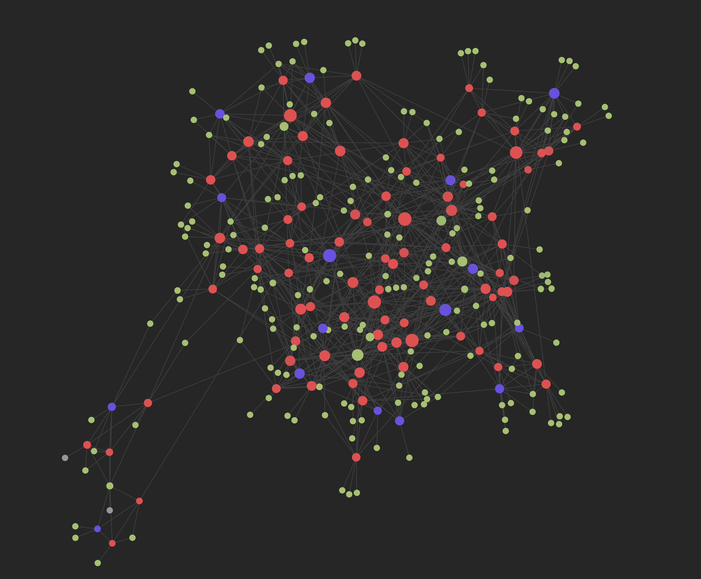
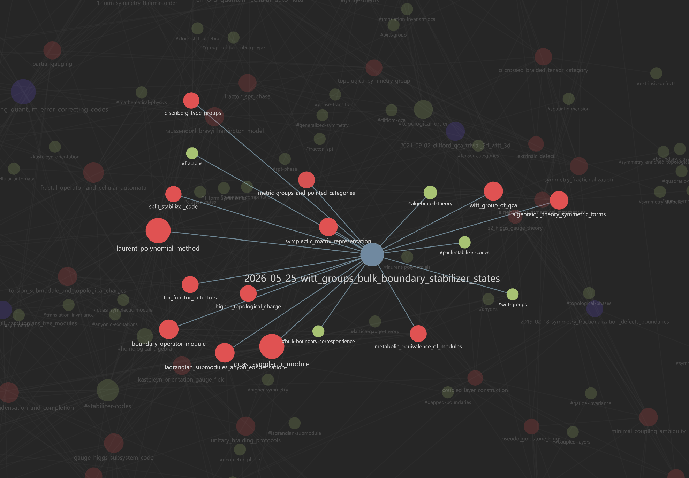
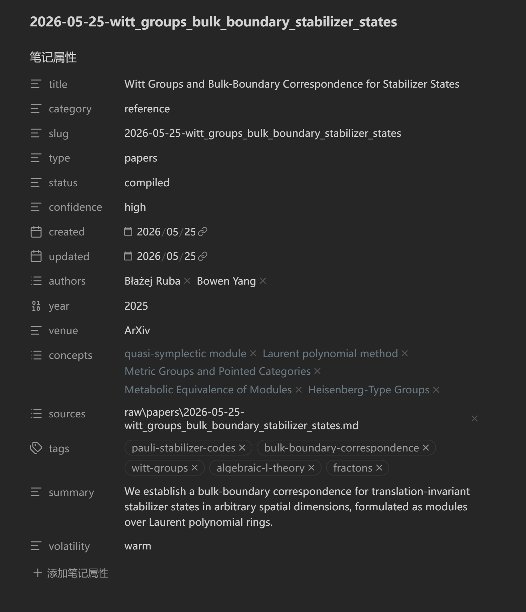
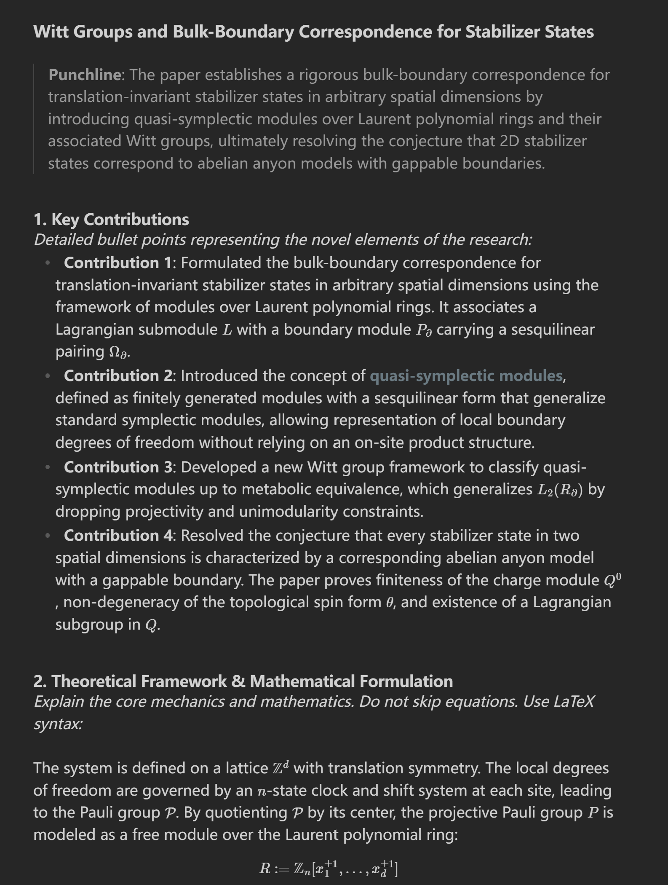

# Agentic Wiki Skills
*[English](README.md) | [中文](README_zh.md)*

本项目为 AI 编程助手（如 Gemini/Antigravity）提供了一套智能体技能（Agentic Skills），使其能够自动化地将学术论文（PDF 和 LaTeX）摄入、编译、整理，并查询为一个兼容 Obsidian 的 Markdown 知识库。

## 🌟 项目展示

以下是由本 AI 自动化流水线完全生成并维护的知识库效果展示：


*一张自动生成的密集语义图，展示了物理和数学概念。*


*后台嵌入引擎自动注入的深层语义关联视图。*


*利用本地 OCR 和 Pandoc，直接从排版混乱的 PDF 中编译出的整洁文献卡片。*


*从 LaTeX 源码中完美提取并格式化的数学证明和引理。*

---

## 1. 核心功能

将其加载到你的 AI 助手后，你可以直接要求 AI：
- **摄入 (Ingest)**：将重度数学公式的 PDF（通过本地 OCR）和 LaTeX 源码转换为 Markdown。
- **编译 (Compile)**：将数学定义、定理和概念提取为一张张相互链接的 Obsidian 独立卡片。
- **去重与链接 (Deduplicate & Link)**：自动发现重复概念，通过 RAG 技术安全合并，并使用本地向量嵌入实现相关文件的语义链接。
- **交互式问答 (Interactive Q&A)**：与你的整个知识库对话（使用 `wiki_ask`），AI 将严格使用本地 RAG、图数据库 SQL 查询和正则搜索来回答你——**保证零幻觉**，并附带精确引用。
- **智能自愈与数学纠错 (Auto-Healing & Math Correction)**：智能 Linter 能够在合并重构期间自动检测死链，并借助全局别名路由系统（Alias Routing）全自动自愈知识图谱中的失效链接。它还搭载了强大的 YAML 级自愈机制以修复大模型元数据语法崩溃（如未转义的反斜杠），以及基于 pdflatex 的公式语法编译器校验和 PDF 视觉图像裁剪纠错技术——支持智能体直接截取 PDF 页面以获取最纯净的公式 ground-truth。

---

## 2. 系统依赖

部署技能前，请确保您的系统安装了以下运行时依赖。

### 2.1 Python 依赖
需要 **Python 3.10+**。全局安装以下 Python 包：
```powershell
pip install -r requirements.txt
```

> **提示**：建议使用虚拟环境以避免依赖冲突：
> ```powershell
> python -m venv .venv
> .\.venv\Scripts\activate  # Windows
> # source .venv/bin/activate  # Linux/macOS
> pip install -r requirements.txt
> ```

### 2.2 系统级外部程序
本流水线依赖一些外部工具，必须将它们添加到系统的 `PATH` 环境变量中：

1.  **Poppler-utils (`pdftoppm` & `pdfimages`)** — 用于渲染 PDF 页面和提取图表。
    *   *Windows (Scoop)*: `scoop install poppler`
    *   *Windows (Choco)*: `choco install poppler`
    *   *macOS (Homebrew)*: `brew install poppler`
    *   *Linux (APT)*: `sudo apt-get install poppler-utils`
2.  **Ripgrep (`rg`)** — 提供极速的多文件引用映射和 wikilink 重构。
    *   *Windows (Scoop)*: `scoop install ripgrep`
    *   *Windows (Choco)*: `choco install ripgrep`
    *   *macOS (Homebrew)*: `brew install ripgrep`
    *   *Linux (APT)*: `sudo apt-get install ripgrep`
3.  **Pandoc** — 用于自动摄入并将 LaTeX (`.tex`) 文档转换为 Markdown。*(注：本仓库已为 Windows 用户内置了 `pandoc-crossref`，无需额外安装)*
    *   *Windows (Scoop)*: `scoop install pandoc`
    *   *Windows (Choco)*: `choco install pandoc`
    *   *macOS (Homebrew)*: `brew install pandoc`
    *   *Linux (APT)*: `sudo apt-get install pandoc`
4.  **TeX / `pdflatex`（推荐）** — 为摄入过程中的深度数学语义校验（双下标、括号不匹配、错误分隔符）提供支持。*可选但推荐*：若缺少 `pdflatex`，`validate_math_latex.py` 会自动回退到基于 `pylatexenc` 的轻量结构校验，此时招牌的 pdflatex 深度校验将不可用。
    *   *Windows (Scoop)*: `scoop install miktex`
    *   *Windows (Choco)*: `choco install miktex`
    *   *macOS (Homebrew)*: `brew install --cask mactex-no-gui`
    *   *Linux (APT)*: `sudo apt-get install texlive-latex-extra`

### 2.3 Ollama 本地模型
离线图像转录与语义链接依赖于后台运行的 Ollama 服务：
```powershell
ollama pull glm-ocr
ollama pull qwen3-embedding:0.6b
```

### 2.4 MinerU 云端 API（可选）
如需更高保真的 PDF 版面/公式提取，`wiki_ingest` 技能可将 [MinerU](https://mineru.net) 云端 API 作为 PDF 的首选路径。**默认关闭**。启用方法：在 `config.yaml` 中填入 Token 并打开开关：
```yaml
ocr:
  mineru_api_token: "your-token-here"
  use_mineru: true
```
未配置 Token 时请保持 `use_mineru: false`；摄入会自动回退到本地 OCR（`wiki_ingest_ocr`）或智能体的原生多模态视觉。

### 2.5 自定义工具路径（可选）
如果您的工具不在 `PATH` 中，可以通过环境变量或 `config.yaml` 配置自定义路径：

**方式 1：环境变量**（从 `.env.example` 创建 `.env` 文件）
```bash
PDFTOPPM_PATH=/path/to/pdftoppm
PDFIMAGES_PATH=/path/to/pdfimages
PANDOC_PATH=/path/to/pandoc
```

**方式 2：编辑 `config.yaml`**（在 agent 目录下）
```yaml
pdf:
  pdftoppm_path: "/path/to/pdftoppm"
  pdfimages_path: "/path/to/pdfimages"
```

详见 `.env.example` 文件中的所有可用选项。

---

## 3. 安装与部署

安装脚本会将 `skills/` 和 `bin/`**并列**复制到目标目录，并一并复制 `requirements.txt`、`.env.example` 和 `config.yaml`。每个技能都相对自身定位辅助脚本（`<BIN> = <skill>/../../bin`），因此**任意**目标目录都可用——只需选择您的 AI 工具用于发现技能的目录：

| AI 工具 | 常见目标目录 |
|---|---|
| Claude Code | `~/.claude`（用户级）或 `<project>/.claude` |
| Gemini / Antigravity | `<project>/.agents` 或 `~/.gemini` |

### Windows
```powershell
Set-ExecutionPolicy -Scope Process -ExecutionPolicy Bypass
.\install.ps1                    # 交互式询问目标目录，或：.\install.ps1 -Target <dir>
```

### Linux / macOS
```bash
bash install.sh                  # 交互式询问目标目录
bash install.sh ~/.claude        # 或直接以参数传入
```

<details>
<summary>手动安装（任意系统）</summary>

```bash
TARGET="$HOME/.claude"           # 您的 AI 工具的技能目录
mkdir -p "$TARGET/skills" "$TARGET/bin"
cp -r skills/* "$TARGET/skills/"
cp -r bin/*    "$TARGET/bin/"
cp requirements.txt .env.example config.yaml "$TARGET/"   # config.yaml 保存 OCR/模型设置
python3 -m pip install -r requirements.txt
```
</details>

---

## 4. 如何使用

安装完成后，直接命令你的 AI 助手在目标主题目录下执行以下工作流：

### 摄入与编译 (Ingestion & Compilation)
- **`wiki_ingest` / `wiki_ingest_ocr`**: 让 AI 处理您 `inbox/` 里的新论文或 PDF。它会通过 OCR 或格式转换将内容输出到 `raw/` 目录。
- **`wiki_compile`**: 让 AI 编译刚提取的原始论文。它将生成结构化的文献笔记，并将所有新发现的数学/物理概念提取到 `wiki/concepts/`。

### 知识图谱维护 (Knowledge Graph Maintenance)
- **`wiki_enrich`**: 让 AI 扫描论文，挖掘遗漏的引理或定理，补充为新的概念卡片。
- **`wiki_tag_sync`**: 利用 Map-Reduce 架构对全图谱的元数据（Tags & Aliases）进行降维清洗。能够自动归并碎片化、复数形式的同义词标签，输出全库标准的本体论 (Ontology) 白名单。
- **`wiki_concept_sync`**: 让 AI 去重。内置了基于本地脚本的物理合并引擎（零大模型幻觉），自动挑选母子概念，实现全局无损级联与双链安全重定向。
- **`wiki_semantic_link`**: 这是一个极速的语义连接引擎。它不仅会在卡片底部自动注入美观的 `[[相关链接|别名]]`，还搭载了 **`--auto-merge`** 无人值守合并功能——当向量置信度 $\ge 0.95$ 时，会在底层瞬间自动完成物理重构。支持基于极速 MD5 的零开销增量更新。

### 问答与学术研究 (Chat & Research)
- **`wiki_ask "你的问题"`**: 向 AI 提出任何关于你知识库的问题。AI 将严格遵循 `[[文献引用]]`，利用 RAG 和图谱 SQL 为你解答，杜绝幻觉。
- **`wiki_audit` / `wiki_research`**: 让 AI 执行深度的文献综述，或者对知识库内的科学矛盾进行审查。

### 基建与生命周期 (Utilities & Workspace Lifecycle)
- **`wiki_init`**: 让 AI 自动生成一个带有标准化目录和配置文件的全新主题工作区。
- **`wiki_lint`**: 在整个知识库中执行结构检查，修复失效链接和元数据。它搭载了全局别名映射系统，能自动为您接驳和修复断裂的死链。
- **`wiki_graph_index`**: 强制手动更新用于 AI 图谱关系查询的 SQLite `graph.db`，并在此过程中无缝静默刷新底层的语义向量缓存库。
- **`wiki_hub_init` / `wiki_hub_manager`**: 用于初始化中央枢纽库 (Hub)，并同时管理（列出/归档/恢复）多个主题仓库。

---
*提示: 所有破坏性操作（合并、覆写）都会自动在 `.backup/` 文件夹中生成备份。*
